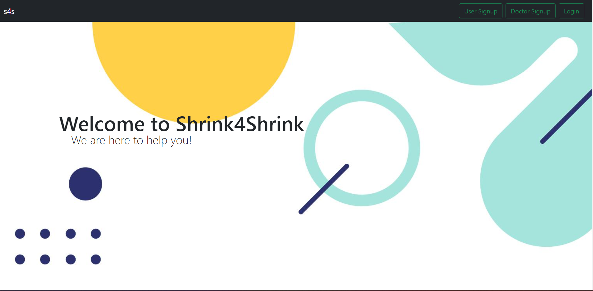

<!--
*** Thanks for checking out my Project. If you have a suggestion
*** that would make this better, please fork the repo and create a pull request
*** or simply open an issue with the tag "enhancement".
*** Don't forget to give the project a star!
*** Thanks again! Now go create something AMAZING! :D
-->

<!-- PROJECT SHIELDS -->

[![LinkedIn][linkedin-shield]](https://www.linkedin.com/in/kaustubh-mogha-6b7342192/)
[![LinkedIn][linkedin-shield]](https://www.linkedin.com/in/mittalavi/)
[![LinkedIn][linkedin-shield]](https://www.linkedin.com/in/jaykakkar31/)

<!-- PROJECT LOGO -->
 

  

 

  <h3 align="center">Shrink4Shrink</h3>

  

  
   An Awesome Healthcare Platform
     
    <a href="https://veersahack.netlify.app/"><strong>Explore App »</strong></a>
     
     
    <a href="">View Demo</a>
    ·
    <a href="https://github.com/KaustubhMogha11/veersahack_server/issues">Report Bug</a>
    ·
    <a href="https://github.com/mittalavi/VeersaHackathon/pulls">Request Feature</a>
  

<!-- TABLE OF CONTENTS -->

  
Table of Contents

  <ol>
    <li>HomePage</li>
    <li>Login/Logout</li>
    <li>Sign Up</li>
    <li>Upcoming Sessions</li>
    <li>Previous Sessions</li>
    <li>Routines</li>
    <li>New Sessions</li>
    <li>Find Doctor</li>
    <li>User/Doctor Profile</li>
     <li>Join Meeting</li>
  </ol>

<!-- ABOUT THE PROJECT -->
## About The Project

#### Problems of Mental People Faced during Covid
COVID has accelerated the adoption of digital healthcare Services. Access to digital information and communication technologies are resulting in increased demand for services in remote health care management. 
In current scenario, mental health of COVID has accelerated the adoption of digital healthcare Services. Access to digital information and communication technologies are resulting in increased demand for services in remote health care management. 
In current scenario, mental health of people has suffered the most, and the medical system has not been able to keep up with the growing demand of mental help. 
Due to COVID, people are still fearing to schedule in-person appoints to consult doctor .
Also many problems like scheduling doctor appointments( unavailability of staff) , getting relevant info for personal healthcare and shyness to consult doctor for mental health. 

Here's why:
* Your time should be focused on only something you really need. A project that solves a problem and helps others.

To overcome the mentioned problems, we came up with a solution to develop a platform for people to schedule online appointments and organize therapy/ psychiatrist sessions.
The platform will use AI to analyze and summarize  the responses of patients during session to give doctor a summary of session and help them to give right advice to their patients.
Platform will also maintain reports of sessions and provide different options to patients to convey their problems/ routine to the doctor.
When a patient joins our platform a set of relevant questions will be asked to generate a report of patient and assign it to doctor who can then read and prepare for session. After the patient can schedule a video call session with doctor .Doctor can either Accept or ask for reschedule. Of course, no shop will serve all products since your needs may be different. So I'll be adding more features in the near future. You may also suggest changes by forking this repo and creating a pull request or opening an issue. Thanks to all the people have reviewed to expanding this CL!

### Built With

* [MaterialUI]
* [Agora.Io]
* [React.js]
* [Node.js]
* [Express.js]
* [MongoDb]
* [Firebase]

(<a href="#top">back to top</a>)

## What's next for shrink4shrink: 
-  Going to add IBM speech to text and summarizer API, platform will generate real time summary of session and present it to doctor ,which he/she will use to give advice to patient
- An android and IOS supported Application

<!-- ROADMAP -->

## Contributing

Contributions are what make the open source community such an amazing place to learn, inspire, and create. Any contributions you make are **greatly appreciated**.

If you have a suggestion that would make this better, please fork the repo and create a pull request. You can also simply open an issue with the tag "enhancement".
Don't forget to give the project a star! Thanks again!

1. Fork the Project
2. Create your Feature Branch (`git checkout -b feature/NewFeature`)
3. Commit your Changes (`git commit -m 'Add some NewFeature'`)
4. Push to the Branch (`git push origin feature/NewFeature`)
5. Open a Pull Request

(<a href="#top">back to top</a>)

<!-- LICENSE -->

<!-- MARKDOWN LINKS & IMAGES -->

[linkedin-shield]: https://img.shields.io/badge/-LinkedIn-black.svg?style=for-the-badge&logo=linkedin&colorB=555

